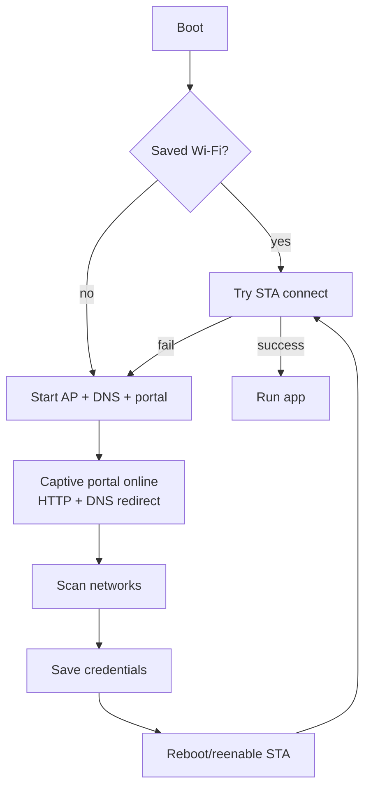

# WiFiManager

[](#release)
[](https://github.com/tzapu/WiFiManager/actions/workflows/compile_library.yml)
[](https://github.com/tzapu/WiFiManager/actions/workflows/compile_examples.yaml)
[](https://platformio.org/lib/show/567/WiFiManager/installation)
[](https://www.ardu-badge.com/WiFiManager)
[](https://www.espressif.com/)
[](https://www.espressif.com/)
[](LICENSE)

Captive-portal Wi-Fi configuration for ESP8266 and ESP32 (all families) with a modern, cache-friendly UI, async/auto-refresh support, and simple drop-in sketches.

---

## Quick links
- [Features](#features-at-a-glance)
- [Install](#install)
- [Use in your sketch](#use-in-your-sketch)
- [Modern UI build/deploy](#modern-ui-build-and-deploy)
- [API contract](#device-api-contract)
- [Flow and behaviour](#flow-and-behaviour)
- [Examples](#examples)
- [Troubleshooting](#troubleshooting)

---

## Features at a glance
| Area | Highlights |
| --- | --- |
| Captive portal | Auto-starts when saved Wi-Fi fails; DNS + HTTP redirect; configurable captive toggle |
| Network scan | Live scan, optional async/non-blocking portal, signal icons, open/secure detection |
| Config UI | Modern Svelte UI with auto-refresh toggle, retry/backoff, activity log, LittleFS/OTA-ready |
| Customization | Hostname, portal timeout, AP SSID/pass, custom params, custom strings |
| Stability | Abortable fetches, retry limits, cached fallback data, optional manual sync |
| Platforms | Arduino for ESP8266 + ESP32 (S2/S3/C3/PRO), PlatformIO, LittleFS |

---

## Install

### Arduino IDE
1. Tools → Board: pick your ESP8266/ESP32 core (latest recommended).
2. Tools → Manage Libraries… search for `WiFiManager` and install.

### PlatformIO (recommended)
Add to `platformio.ini`:
```ini
[env:esp32]
platform = espressif32
board = esp32-s3-devkitc-1
framework = arduino
lib_deps = tzapu/WiFiManager
board_build.filesystem = littlefs
```

### Local development copy
If you are editing the library, point PlatformIO to the repo root:
```ini
lib_deps = ${PROJECT_DIR}/../..
```

---

## Use in your sketch

Minimal blocking setup:
```cpp
#include <WiFiManager.h>

WiFiManager wm;

void setup() {
  Serial.begin(115200);
  wm.autoConnect("ESP32_SETUP", "configureme"); // blocks until configured/connected
  Serial.println(WiFi.localIP());
}

void loop() {
}
```

Non-blocking portal (keep `loop()` alive):
```cpp
WiFiManager wm;

void setup() {
  wm.setConfigPortalBlocking(false);
  wm.autoConnect("ESP32_SETUP", "configureme"); // portal runs, returns immediately
}

void loop() {
  wm.process(); // required for captive portal + API
  // your app logic
}
```

Custom params:
```cpp
WiFiManagerParameter apiKey("api", "API Key", "", 64);
wm.addParameter(&apiKey);
wm.autoConnect();
Serial.printf("Saved key: %s\n", apiKey.getValue());
```

Captive portal password:
```cpp
wm.autoConnect("ESP32_SETUP", "password123"); // 8-63 ASCII chars
```

Callbacks:
```cpp
wm.setAPCallback([](WiFiManager *mgr){ Serial.println("Portal started"); });
wm.setSaveConfigCallback([](){ Serial.println("Config saved"); });
```

---

## Modern UI build and deploy
Svelte UI lives in `svelte-wifi-ui` and is pre-packaged into the PlatformIO example.

Build UI:
```bash
cd svelte-wifi-ui
npm install
npm run build
```
Artifacts land in `dist/`.

Bundle into ESP32-S3 LittleFS example:
```bash
# copy built assets
cp svelte-wifi-ui/dist/index.html examples/pio-esp32-s3-ui/data/
cp svelte-wifi-ui/dist/assets/* examples/pio-esp32-s3-ui/data/assets/
```

Flash firmware + LittleFS (requires path without spaces, e.g. `/tmp/modernwifi_v2_build`):
```bash
cd /tmp/modernwifi_v2_build/examples/pio-esp32-s3-ui
python3 -m platformio run -e esp32-s3-devkitc-1       # build firmware
python3 -m platformio run -e esp32-s3-devkitc-1 -t buildfs
python3 -m platformio run -e esp32-s3-devkitc-1 -t uploadfs
python3 -m platformio run -e esp32-s3-devkitc-1 -t upload
```
Default portal AP: `ESP32_SETUP` / `configureme` at `192.168.4.1`.

> UI snapshots: see `examples/pio-esp32-s3-ui/data/index.html` (built from `svelte-wifi-ui/dist`) for the latest visuals.

---

## Device API contract
The UI talks to these endpoints (provided by WiFiManager):

| Endpoint | Method | Returns | Notes |
| --- | --- | --- | --- |
| `/api/status` | GET | `{ connected, ssid, ip, ap, hostname, portalActive, apClients, fw, uptime }` | Captive portal aware |
| `/api/scan` | GET | `[ { ssid, strength, secure, channel, latency? } ]` | `?refresh=1` to force scan |
| `/api/connect` | POST (form) | `{ connected, status, ip }` | Params: `ssid`, `password` |
| `/api/config` | GET/POST (form) | GET returns `{ hostname, portalTimeout, captive, apSsid, apPasswordSet }` | POST accepts same fields |

When offline, the UI keeps cached values and a demo network list so the portal stays usable.

---

## Flow and behaviour


Non-blocking vs blocking portal:

| Mode | Call | Behaviour | Use when |
| --- | --- | --- | --- |
| Blocking | `autoConnect()` (default) | Waits inside call until Wi‑Fi is configured/connected | Simple sketches |
| Non-blocking | `setConfigPortalBlocking(false); autoConnect();` + `wm.process()` in `loop()` | Portal/API keep running while your loop executes | UIs, sensors, async tasks |

---

## Examples
- `examples/pio-esp32-s3-ui` — ESP32-S3 with LittleFS + modern UI and API routes.
- `examples/Basic` — minimal blocking portal.
- `examples/NonBlocking` — keep loop responsive while portal runs.

Clone and open in PlatformIO/Arduino IDE; update `platformio.ini` board to match your hardware.

---

## Troubleshooting
- **Path has spaces**: PlatformIO filesystem build fails; use a path without spaces (`/tmp/modernwifi_v2_build`).
- **Portal password invalid**: must be 8–63 ASCII characters.
- **ESP32S3 FreeRTOS tick**: set `-DCONFIG_FREERTOS_HZ=1000` (already applied in example).
- **Captive portal not showing**: ensure DNS server running (`wm.process()` in non-blocking); disable STA if a stale connection hangs scans (`wm.setDisableSTA(true)`).
- **CORS/API issues**: WiFiManager already sets permissive CORS headers for `/api/*`.

---

## Project layout (important bits)
```
WiFiManager.h / WiFiManager.cpp   # library
examples/pio-esp32-s3-ui          # PlatformIO example with modern UI
examples/pio-esp32-s3-ui/data     # LittleFS content (built UI)
svelte-wifi-ui                    # Svelte source for the UI
```

---

## Release
See GitHub releases or Arduino/PlatformIO registries. Current library.json version: 2.0.17.

---

## Community
[Discord](https://discord.gg/nS5WGkaQH5) • [Gitter](https://gitter.im/tablatronix/WiFiManager)
